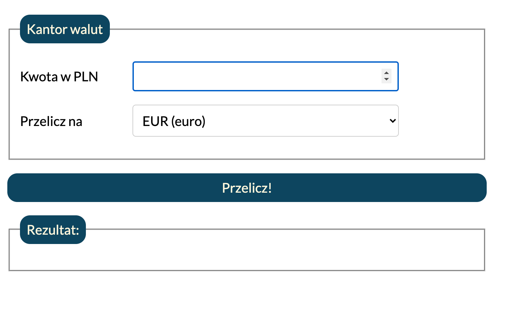

# My simple currency converter
## Demo
https://martaszymborska.github.io/currency-converter/
## Opis
Simple currency converter made to practice:
- JS (numbers and strings, actions: submit, input)
- forms in HTML
- styling in CSS
- validation and sending forms
- introduction to function

Converter is very simple - you can convert PLN into one of four currenciens. Unfortunately I can't make dynamic rates yet, so I used rates accurate for the day I've made the converter. You can check those rates in the table added below the converter.

